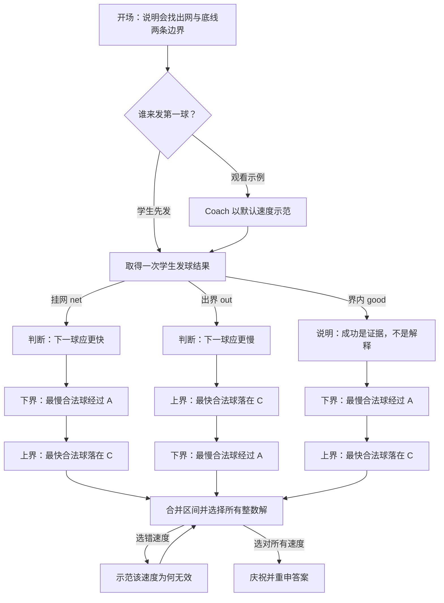

# Coach 对话蓝图

> 用途：把 Coach 的教学意图、分支和画面行为放在一个可评审的文档里。产品、教学设计和开发可以直接在这里讨论「为什么要问」「可接受哪些答案」「答错后如何继续」；实际文案与运行逻辑仍以 `js/services/coach-script.js` 为准。

## 1. 教学目标

学生要从一次发球的观察，推导出两个限制条件：

- 最慢合法球刚好经过网顶 **A**，因为碰到网带仍算失误，所以 `v > vMin`。
- 最快合法球刚好落在远端底线 **C**，压线有效，所以 `v ≤ vMax`。
- 结合两者，选出合法的整数速度。

当前题目配置下，`vMin = 20.1 m/s`，`vMax = 22.5 m/s`，所以答案为 **21 m/s、22 m/s**。这些数值来自题目配置和物理计算；文档中的具体数值应随题目变化而更新。

## 2. 术语与画面标记

| 标记 | 含义 | 在教学中的角色 |
| --- | --- | --- |
| A | 球网顶端 | 最慢合法球的边界点 |
| B | 球网落地点 | 干扰项：球经过这里已经撞网 |
| C | 对侧底线 | 最快合法球的边界点 |
| `net` | 球未过网 | 从「下界」开始教学 |
| `out` | 球越过底线 | 从「上界」开始教学 |
| `good` | 球过网且落在界内 | 成功只是证据，仍要推导两条边界 |

## 3. 总流程

## 4. 分支脚本

### 4.1 开场

| 节点 | Coach 行为／文案意图 | 学生输入 | 后续 |
| --- | --- | --- | --- |
| `opening.frame` | 说明会把每一次发球转化为「网」和「底线」两个边界条件 | 无 | 询问首球方式 |
| `opening.choose` | 「你想先发球，还是先看示例？」 | 自己发 / 看示例 | 自己发：等待学生；示例：Coach 以默认速度发球，再依据实际结果进入下列分支 |

### 4.2 挂网：`net`

| 节点 | Coach 行为／文案意图 | 学生输入 | 纠错与画面 | 后续 |
| --- | --- | --- | --- | --- |
| `net.observe` | 报告球到网前的高度及低于网带的距离 | 无 | 无 | 判断快慢 |
| `net.direction` | 问「要过网，下一球应该更快还是更慢？」 | 更快 / 更慢 | 若答「更慢」：保留原轨迹，示范两条更慢的球，说明球在空中更久、下落更多，再问一次 | 答对或解释后进下界 |

### 4.3 出界：`out`

| 节点 | Coach 行为／文案意图 | 学生输入 | 纠错与画面 | 后续 |
| --- | --- | --- | --- | --- |
| `out.observe` | 报告落地点及越过底线的距离 | 无 | 无 | 判断快慢 |
| `out.direction` | 问「要把落点拉回界内，应该更快还是更慢？」 | 更快 / 更慢 | 若答「更快」：保留原轨迹，示范两条更快的球，说明滞空时间相同但水平距离更远，再问一次 | 答对或解释后先进上界 |

### 4.4 成功：`good`

| 节点 | Coach 行为／文案意图 | 学生输入 | 后续 |
| --- | --- | --- | --- |
| `good.observe` | 报告过网余量与距底线的余量；强调「这只是证据，还不是解释」 | 无 | 依序进入下界、上界 |

### 4.5 下界：最慢合法球

| 节点 | Coach 行为／文案意图 | 学生输入 | 纠错／画面 | 后续 |
| --- | --- | --- | --- | --- |
| `lower.point` | 问最慢合法球刚好经过哪个点 | A / B / C，可点球场标记 | 标记 A、B、C。第一次答错：说明 B 已撞网、C 属于上界，然后重问；第二次仍错：直接指定 A，避免卡住 | 播放临界球 |
| `lower.demo` | 隐藏速度，播放刚好经过 A 的临界发球 | 无 | 只保留 A；显示水平距离与竖直下落的虚线；球员会完成发球动作 | 估算速度 |
| `lower.speed` | 问「刚好到达 A 的球速是多少？」 | 三个候选速度 | 第一次答错：展示两步计算：先求下落到网顶的时间，再用距离除以时间；再问一次 | 说明严格不等式 |
| `lower.rule` | 明确碰网为失误，因此 `v > vMin` | 无 | 无 | 进入上界或结论 |

### 4.6 上界：最快合法球

| 节点 | Coach 行为／文案意图 | 学生输入 | 纠错／画面 | 后续 |
| --- | --- | --- | --- | --- |
| `upper.point` | 问最快合法球刚好落在哪个点 | A / B / C，可点球场标记 | 标记 A、B、C。第一次答错后解释并重问；第二次仍错则直接指定 C | 播放临界球 |
| `upper.demo` | 隐藏速度，播放刚好落在 C 的临界发球 | 无 | 只保留 C；显示水平距离与竖直下落的虚线；球员会完成发球动作 | 估算速度 |
| `upper.speed` | 问「刚好落在 C 的球速是多少？」 | 三个候选速度 | 第一次答错：用 LaTeX 展示两步计算，先由完整下落高度求时间，再用到 C 的距离除以时间；随后重问 | 说明包含等号的不等式 |
| `upper.rule` | 确认临界速度，并说明底线压线有效，因此 `v ≤ vMax` | 无 | 无 | 进入下界或结论 |

### 4.7 结论与验证

| 节点 | Coach 行为／文案意图 | 学生输入 | 纠错／画面 | 后续 |
| --- | --- | --- | --- | --- |
| `final.interval` | 并列两个条件，再写成 `vMin < v ≤ vMax` | 无 | 无 | 多选整数速度 |
| `final.select` | 「选择所有可行的整数速度」 | 20 / 21 / 22 / 23 m/s | 选 20：示范仍会挂网；选 23：示范会出界。选错后保留问题，直到正确选齐 | 完成 |
| `final.complete` | 庆祝并确认 21 m/s 与 22 m/s | 无 | 无 | 结束 |

## 5. 关键互动规则

- **回答方式**：所有单选题均可点选按钮；A/B/C 点位题还可直接点击球场标记。
- **不中断学习**：点位题最多给两次机会，之后 Coach 会明示正确边界点并继续；速度题答错后给出计算提示，再继续。
- **以观察纠正直觉**：对「挂网应更慢」「出界应更快」这两种常见误解，不只给结论，而是播放两个反例。
- **速度属于场景，不属于文本**：示范、轨迹保留、点位和辅助线是对话步骤的一部分，应在评审脚本时一并审看。
- **学生优先**：学生再次发球会中断 Coach 正在播放或等待的对话，随后用新结果启动一段干净的对话。

## 6. 文档—实现对照

| 本文节点 | 实现位置 | 覆盖测试 |
| --- | --- | --- |
| 开场、三种入口分支 | `js/services/coach-script.js`：`opening`、`guideFromResult` | `tests/coach-flow.mjs` 的 opening、net、out、good 场景 |
| 下界／上界／最终验证 | `js/services/coach-script.js`：`teachLowerBound`、`teachUpperBound`、`finishWindow` | `tests/coach-flow.mjs` 的完整学习路径 |
| 按钮、等待、取消、球场点选 | `js/ui/coach.js` | `tests/coach-flow.mjs` 的 canvas marker 与 interruption 场景 |

## 7. 推荐的协作方式

1. 先在本文档中评审或修改某个节点的**教学目的、问题、选项、误解处理和画面行为**。
2. 确认后，再同步修改 `coach-script.js` 的实现与 `coach-flow.mjs` 的行为测试。
3. 若未来题型增多，再将第 4 节的节点表迁移为 YAML/JSON 对话配置；在逻辑尚稳定前，不建议过早把它做成通用编辑器，避免文档、配置、代码三份内容失去同步。
