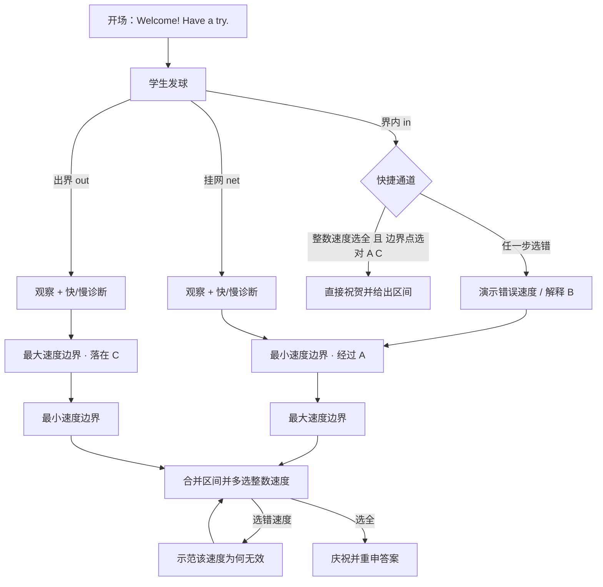

# Coach 对话蓝图

> 用途：把 Coach 的教学意图、分支和画面行为放在一个可评审的文档里。产品、教学设计和开发可以直接在这里讨论「为什么要问」「可接受哪些答案」「答错后如何继续」；实际文案与运行逻辑仍以 `js/services/coach-script.js` 为准。

## 1. 教学目标

学生要从一次发球的观察，推导出**同一个速度区间的两个端点**：

- **最小速度边界**（minimum-speed boundary）：最慢的合法球刚好经过网顶 **A**，碰到网带仍算失误，所以 `v > vMin`。
- **最大速度边界**（maximum-speed boundary）：最快的合法球刚好落在远端底线 **C**，压线有效，所以 `v ≤ vMax`。
- 两者合并，选出合法的整数速度。

当前题目配置下，`vMin = 20.1 m/s`，`vMax = 22.5 m/s`，所以答案为 **21 m/s、22 m/s**。这些数值来自题目配置和物理计算；文档中的具体数值应随题目变化而更新。

### 1.1 两条边界是平级的

这是本次设计的核心约束。两个端点不存在先后、主次或因果关系：它们各自独立成立，用**完全相同的四步**求出（定边界点 → 看隐藏速度的临界演示 → 教学计算 → 写出不等式），顺序由学生的行为决定。

因此：

- 代码里只有一个 `teachBoundary(dsl, key)`，两端共用；差异全部收在 `BOUNDARIES` 常量表里，两个条目结构完全一致。
- 文案中禁止出现 “second boundary”“next boundary”“另一半答案” 这类排序或从属表述。指代未完成的一端时，直接叫它的名字（“the maximum-speed boundary”），或说“还没做的那一条”。
- 先讲的一条用 “Start with the …”，后讲的一条用 “That leaves the …”——这是描述剩余工作量，不是排名。
- `tests/coach-flow.mjs` 与 `workers/volleyball-coach/tests/coach.test.mjs` 都有断言守住这一点。

## 2. 术语与画面标记

| 标记 | 含义 | 在教学中的角色 |
| --- | --- | --- |
| A | 球网顶端 | 最小速度边界的边界点 |
| B | 球网落地点 | 干扰项，不是边界；经过 B 的球只有 11.25 m/s，早已深埋网中 |
| C | 对侧底线 | 最大速度边界的边界点 |
| `net` | 球未过网 | 证据指向**最小速度边界** |
| `out` | 球越过底线 | 证据指向**最大速度边界** |
| `in` | 球过网且落在界内 | 触发**快捷通道**（见 §5） |

## 3. 总流程

进度是**跨发球保留**的：`ui/coach.js` 里的 `progress = { min, max, fastTrackTried, complete }` 不随脚本重启而清空。学生中途重新发球，Coach 只会从还没完成的那一条继续，绝不重讲已经推完的一条；两条都完成后再发球，只给一句观察式点评。

## 4. 分支脚本

### 4.1 开场

| 节点 | Coach 行为／文案意图 | 学生输入 | 后续 |
| --- | --- | --- | --- |
| `opening` | 一句欢迎，不解释、不演示 | 无 | 学生自己发第一球 |

学生若在发球前直接向 AI Coach 提问，prompt 规定从**最小速度边界**（A）开始。

### 4.2 挂网：`net` → 最小速度边界

| 节点 | Coach 行为／文案意图 | 学生输入 | 纠错与画面 | 后续 |
| --- | --- | --- | --- | --- |
| `min.diagnose` | 报告球到网前的高度及低于网带的距离，问「下一球应该更快还是更慢？」 | 更快 / 更慢 | 若答「更慢」：保留原轨迹，示范两条更慢的球，说明球在空中更久、下落更多，再问一次 | 进入最小速度边界 |

若最小速度边界已经推完，跳过诊断，只报告结果，然后转到还没完成的那一条。

### 4.3 出界：`out` → 最大速度边界

| 节点 | Coach 行为／文案意图 | 学生输入 | 纠错与画面 | 后续 |
| --- | --- | --- | --- | --- |
| `max.diagnose` | 报告落点及越过底线的距离，问「应该更快还是更慢？」 | 更快 / 更慢 | 若答「更快」：保留原轨迹，示范两条更快的球，说明滞空时间相同但水平距离更远，再问一次 | 进入最大速度边界 |

### 4.4 边界模块（两端共用）

`teachBoundary` 对 `min` 与 `max` 走同一条路径，只替换点位、几何量与不等式方向。

| 节点 | Coach 行为／文案意图 | 学生输入 | 纠错／画面 | 后续 |
| --- | --- | --- | --- | --- |
| `point` | 问该端点的临界球刚好经过哪个点 | A / B / C，可点球场标记 | 标记 A、B、C。选 B：给出**预设定量回答**（落到 B 需下落全程 3.2 m、耗时 0.80 s，对应 11.25 m/s，深埋网中，不是边界）。选另一端点：说明它属于另一条边界，两者同等重要。第二次仍错：直接指定正确点位 | 播放临界球 |
| `demo` | 隐藏速度，播放刚好到达该点的临界发球 | 无 | 只保留该点；显示水平距离与竖直下落的虚线；球员完成发球动作 | 教学计算 |
| `calculate` | 问「刚好到达该点的球速是多少？」 | 三个候选速度 | 第一次答错：用 KaTeX 展示两步计算（先由下落高度求时间，再用水平距离除以时间）；再问一次 | 写出不等式 |
| `rule` | `min`：碰网算失误，边界严格，`v > vMin`；`max`：压线有效，边界含等号，`v ≤ vMax` | 无 | 无 | 标记该端完成 |

### 4.5 快捷通道：`in`

只有在**两条边界都还没开始**、且本次是首次触发时才进入。目的是不让已经会做的学生被迫走一遍完整推导，同时仍然要求他证明自己会。

| 节点 | Coach 行为／文案意图 | 学生输入 | 纠错／画面 | 后续 |
| --- | --- | --- | --- | --- |
| `fast-track.speeds` | 报告本次发球的过网余量与距底线余量，然后问「还有哪些整数速度也行？」 | 多选 20 / 21 / 22 / 23 m/s，**学生刚发的那个速度默认已选中** | 选中任一错误速度即判错：演示该速度、说明失败原因，然后转入 §4.4 完整推导 | 选全则进入点位题 |
| `fast-track.points` | 「那你已经知道两个极限大概在哪了，把它们指出来」 | 多选 A / B / C，需同时选 A 和 C | 选 B：给出同一段预设定量回答，然后转入完整推导 | 选对则收尾 |
| `fast-track.finish` | 依次说明 A 定最小速度边界（`v > vMin`）、C 定最大速度边界（`v ≤ vMax`），合并区间，庆祝 | 无 | 无 | 结束，`progress.complete = true` |

任何一步答错都会回到 §4.4，两条边界仍会被逐条引导，所以快捷通道不会成为绕过学习的漏洞。

### 4.6 结论与验证

| 节点 | Coach 行为／文案意图 | 学生输入 | 纠错／画面 | 后续 |
| --- | --- | --- | --- | --- |
| `interval.final` | 并列两个条件，再写成 `vMin < v ≤ vMax` | 无 | 无 | 多选整数速度 |
| `interval.final` | 「选择所有可行的整数速度」 | 20 / 21 / 22 / 23 m/s | 选 20：示范仍会挂网；选 23：示范会出界。选错后保留问题，直到正确选齐 | 完成 |
| 完成 | 庆祝并确认 21 m/s 与 22 m/s | 无 | 无 | 结束 |

候选速度不再写死，而是由 `bounds` 推出（`floor(vMin) … ceil(vMax)`），换题目时自动跟随。

## 5. 关键互动规则

- **回答方式**：所有单选题均可点选按钮；A/B/C 点位题还可直接点击球场标记。
- **不中断学习**：点位题最多给两次机会，之后 Coach 明示正确边界点并继续；速度题答错后给出计算提示，再继续。
- **以观察纠正直觉**：对「挂网应更慢」「出界应更快」这两种常见误解，不只给结论，而是播放两个反例。
- **B 永远由预设文案回答**：B 的解释是确定性的、带数字的，不交给模型即兴发挥。Worker 的 `pointB` 预设段落与 `coach-script.js` 的 `pointBReply` 说的是同一件事。
- **速度属于场景，不属于文本**：示范、轨迹保留、点位和辅助线是对话步骤的一部分，应在评审脚本时一并审看。
- **学生优先**：学生再次发球会中断 Coach 正在播放或等待的对话，但**不会清空教学进度**。

## 6. 与 AI Coach 的衔接

学生可以在任何时候向 AI Coach 自由提问。提问会把当前的预设选项暂存起来，答完后用一个「Got it — continue」按钮做过渡，再把原来的选项原样恢复。

为了让模型接得上，`ui/coach.js` 会把下列进度信息一起送进请求上下文：

| 字段 | 含义 |
| --- | --- |
| `lessonRoute` | `min` / `max` / `fast-track` / `interval` / `none` |
| `lessonStep` | `diagnose` / `point` / `demo` / `calculate` / `rule` / `speeds` / `points` / `final` / `none` |
| `lessonCompleted` | 已经推完的边界，如 `['min']` |
| `lessonFinished` | 整个区间是否已经建立 |
| `pendingQuestion` | 屏幕上正在等待作答的那一问 |

Worker 的 `normalizeCoachInput` 对这些字段做白名单校验，模型无法用它们改变判分；prompt 则规定：已在 `lessonCompleted` 里的边界不得重讲，`fast-track` 状态下不要退回逐步推导。

## 7. 文档—实现对照

| 本文节点 | 实现位置 | 覆盖测试 |
| --- | --- | --- |
| 开场、三种入口分支 | `js/services/coach-script.js`：`opening`、`guideFromResult` | `tests/coach-flow.mjs` 的 opening、net、out 场景 |
| 边界模块（两端共用） | `js/services/coach-script.js`：`BOUNDARIES`、`teachBoundary` | `tests/coach-flow.mjs` 的 startMin/startMax、solveMinSpeed/solveMaxSpeed |
| 快捷通道 | `js/services/coach-script.js`：`fastTrack` | `tests/coach-flow.mjs` 的 fast-track 成功、速度答错、选 B 三个场景 |
| 跨发球进度 | `js/ui/coach.js`：`progress`、`completeRoute`、`finishLesson` | `tests/coach-flow.mjs` 的进度保留场景 |
| 按钮、预选、等待、取消、球场点选 | `js/ui/coach.js`：`ask`、`askMulti`、`interrupt` | `tests/coach-flow.mjs` 的 canvas marker 与 interruption 场景 |
| AI 上下文与恢复 | `js/ui/coach.js`：`currentAiContext`、`continuePresetPath` | `tests/coach-flow.mjs` 的 AI 场景；`workers/volleyball-coach/tests/coach.test.mjs` |

## 8. 推荐的协作方式

1. 先在本文档中评审或修改某个节点的**教学目的、问题、选项、误解处理和画面行为**。
2. 确认后，再同步修改 `coach-script.js` 的实现与 `coach-flow.mjs` 的行为测试。
3. 教学表述若有变化，同时检查 `workers/volleyball-coach/prompts/volleyball-coach.md`，避免预设 Coach 与 AI Coach 说法不一致。
4. 若未来题型增多，再将第 4 节的节点表迁移为 YAML/JSON 对话配置；在逻辑尚稳定前，不建议过早把它做成通用编辑器，避免文档、配置、代码三份内容失去同步。
